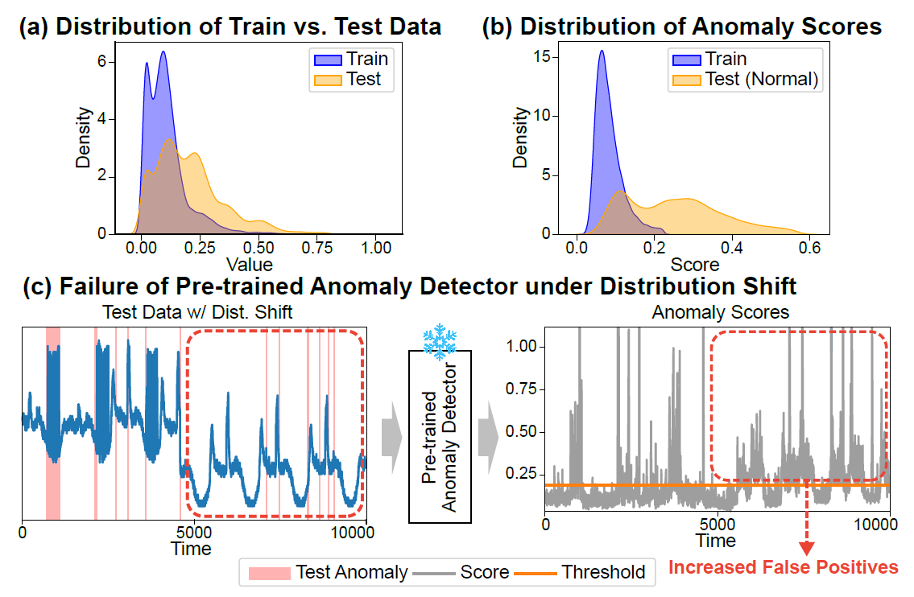
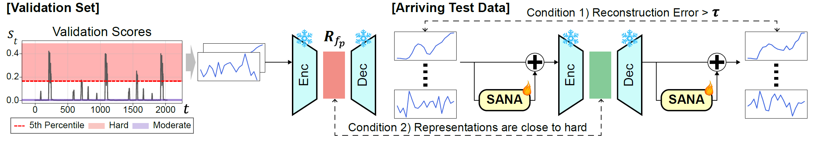

# [AAAI 2026] CANDI: Curated Test-Time Adaptation for Multivariate Time-Series Anomaly Detection Under Distribution Shift

  

Motivation: [Top] Real-world time-series data often exhibit non-stationarity, leading to continuous distribution shifts between training and test data. [Bottom] As shown in the later
part of the anomaly scores, under distribution shift, pretrained anomaly detectors can provide excessive false positives, undermining reliability under deployment.

  

Overview: Overall framework of CANDI. [Left] Anomaly scores are first computed on a normal validation set, and latent representations of samples falling within the top α-percentile (e.g., 5th percentile) are extracted and stored in a reference false positive set $\mathcal{R}_{fp}$. [Right] For arriving test data, if the anomaly score is above the threshold, its latent representation is compared to those in $\mathcal{R}_{fp}$. If the distance is sufficiently small, the sample is identified as a potential false positive and used for adaptation. Adaptation is performed via the plug-and-play Spatiotemporally-Aware Normality Adaptation (SANA) module, which updates only a lightweight residual component while preserving the knowledge and latent space of the pre-trained anomaly detector.

## 📂 Dataset Preparation

### Download Links
- [SWaT](https://itrust.sutd.edu.sg/itrust-labs_datasets/dataset_info/)
- [SMD](https://github.com/NetManAIOps/OmniAnomaly/tree/master)


For the `SMD` dataset, preprocessing was performed based on the script available at [data_preprocess.py](https://github.com/NetManAIOps/OmniAnomaly/blob/master/data_preprocess.py). After preprocessing, the dataset was placed in the following directory:

```
data/ServerMachineDataset/preprocessed/  # Preprocessed SMD dataset
```

### Dataset Organization
Place the downloaded datasets in the `data/` directory, ensuring each dataset resides in its respective subdirectory:

```
data/
├── SWaT/
└── ServerMachineDataset/
```

---

## 🚀 Example Execution

Scripts for running the model are located in the `scripts/` directory. Use the following command to execute the model:

```bash
bash scripts/{dataset}/{dataset}_alpha_{alpha}.sh
```

**Example:** To run the model on the `SWaT` dataset:

```bash
bash scripts/SWaT/SWaT_alpha_5.0.sh
```

---

The results of the model execution are saved in the `results/{dataset}` directory. 


## 📊 Results on TSB-AD Benchmark

To further validate the generality and robustness of CANDI, we additionally evaluated it on the large-scale [TSB-AD](https://github.com/thedatumorg/TSB-AD) benchmark, which provides over 1000 carefully curated TSAD datasets and addresses several limitations of prior benchmarks.

In this setting, we report not only standard metrics such as AUPRC and AUROC but also VUS-PR and VUS-ROC, as these metrics offer a more holistic assessment of anomaly-detection performance.

Because our method targets multivariate TSAD, we conducted evaluations on the designated subset of 200 multivariate datasets.

We added our CANDI implementation on top of the TSB-AD codebase within the `TSB-AD/` directory. Evaluation results can be found in `TSB-AD/benchmark_exp/eval/metrics/multi/`.

For dataset preparation and further details, please refer to [TSB-AD](https://github.com/thedatumorg/TSB-AD).

## 📝 Citation

If you find our work useful, please cite our paper:

```bibtex
@inproceedings{kim2026candi,
  title={CANDI: Curated Test-Time Adaptation for Multivariate Time-Series Anomaly Detection Under Distribution Shift},
  author={Kim, HyunGi and Mok, Jisoo and Lee, Hyungyu and Shin, Juhyeon and Yoon, Sungroh},
  booktitle={Proceedings of the AAAI Conference on Artificial Intelligence},
  volume={40},
  number={17},
  pages={15018--15026},
  year={2026}
}
```

---

## ⚖️ License

This project is licensed under the MIT License. For commercial use, permission is required.

---

## 🙏 Acknowledgements

Please provide proper attribution if you use our codebase.  
If you use our work, kindly cite our paper as mentioned in the Citation section.